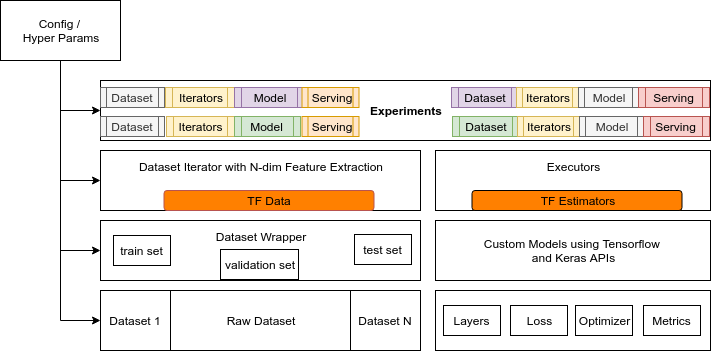

[](https://vitaflow.readthedocs.io/en/latest/?badge=latest)
[](https://github.com/imaginea/vitaflow/blob/master/LICENSE)
 

# VitaFlow - VideoImageTextAudioFlow
 

# Table of content

- [Introduction](#introduction)
- [Problem Statement](#problem-statement)
- [Proposed Solution](#proposed-solution)
- [Development](#development)
- [Examples](#examples) 
- [License](#license)
- [Contributions](#contributions) 
- [References](#references) 

 
# Introduction
Exploring data science projects or experimenting new ideas/algorithms are often exciting and fun to play around.

However when it comes to building an end-to-end Machine Learning pipeline to handle different data sets and models or 
algorithms, will often put us in a tough spot with lot of engineering challenges/aspects which were neglected previously.

The process itself encompasses many small details and tasks that the data science community does not tend to celebrate 
(at least, not as much as the newest algorithm!). The algorithm itself is a very small piece of the whole ecosystem — 
much like the little black box in this image:


# Problem Statement

The challenge is to build a pipeline with different moving parts that are loosely coupled, which then can be used to
iterate through the data handling, model building, test and deploy in an incremental fashion, and repeat the whole process.
Layout a platform that take cares of engineering aspects of Data Science projects.   


# Proposed Solution

> __Data Science wisdom comes only through failed experimentation - Damian Mingle__

The thought process is to come up with following modular components which can then be glued through
configuration:

 - Data Collection and Cleansing
 - Annotation tools
 - Dataset modules with pre-processing modules
 - DataIterator modules (backed by [TF Data](https://www.tensorflow.org/guide/datasets))
 - Tensorflow Models (backed by [TF Estimators](https://www.tensorflow.org/guide/estimators))
 - An Engine to run the models
 - Tensorflow model serving using [TFLite](https://www.tensorflow.org/lite/)
    - Web app
    - Mobile

# Development

We are continuously exploring and extending VitaFlow, by solving some real world problems. 

As baseline problem we have considered [Receipts](vitaflow/playground/receipt_ocr/) to extract some useful text information from camera images. 


 
## VitaFlow Components

1. __Tensorflow Model Experimentation Engine__

    We started vitaFlow with a vision to build a plug and play framework for Tensorflow model experimentation 
    with different datasets, that enables a fast prototyping of Deep Learning models that handles Video/Image/Text/Audio 
    and provide a seamless way of serving them in different end points.
    Addressing some of the following cases:
    - __A Naive Developer__: Can I get an experimentation play ground, with some set of open datasets, data iterators 
    and models? to learn by doing?
    - __A Data Scientist__: Can I build a model with an available open dataset and later switch to production dataset 
    when the Data Engineering team bring in the production data?
    - __A Data Engineer__: Can I use any available model and run through my data during my data preparation cycle?
    - __An Online Competitor__: Can I reuse the models and pieces of modules that I have developed for my last 
    competition in my current competition? 
    - __Business Deadlines__ : We had spend few months of effort while addressing a client's proposals and build a prototype. 
    Can we showcase the prototype developed to upcoming project proposals as quick as possible?
    

    In our exploration, we came across [Tensor2Tensor](https://github.com/tensorflow/tensor2tensor), which does what we intended to do. **So we ported minimalistic and essential T2T components, and evaluating it for our needs**
     

    ```sh
    cd /path/to/vitaflow_repo/
    #list down all available problems(datasets), models and hyper parameters
    vitaflow/bin/vf-trainer --registry_help=true

    PROBLEM=conll2002_es_ner
    MODEL=lstm_seq2seq
    MODEL_HPARAMS=lstm_seq2seq
    DATA_DIR=~/vf_data
    TEMP_DIR=~/vf_data/tmp
    MODEL_OUT_DIR=~/vf_train/$PROBLEM\_$MODEL

    python vitaflow/bin/vf-trainer \
    --generate_data \
    --problem=$PROBLEM \
    --data_dir=$DATA_DIR \
    --tmp_dir=$TEMP_DIR \
    --model=$MODEL \
    --hparams_set=$MODEL_HPARAMS \
    --output_dir=$MODEL_OUT_DIR \
    --train_steps=1000 \
    --eval_steps=100
    ```

    For more detailed walthrough check out [here](vf-tf-engine-walkthrough.md)!  

2. __Annotation Server__

    We took a open source [Image annotation tool](https://github.com/frederictost/images_annotation_programme) and 
    improvised to meet our needs. Check [here](vitaflow/annotate_server) for more details.


# License

Apache License - Version 2.0.

# [Contributions](contributions.md)

# References

- [Image annotation tool](https://github.com/frederictost/images_annotation_programme)
- [Tensor2Tensor](https://github.com/tensorflow/tensor2tensor)
