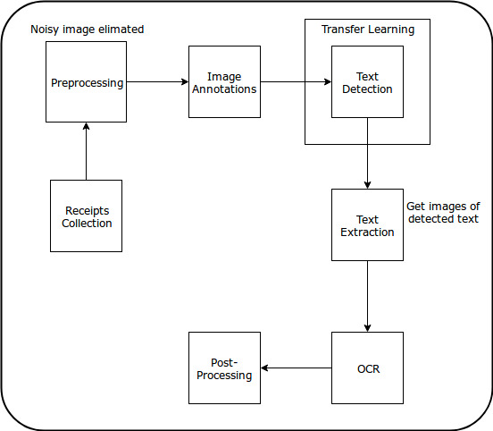
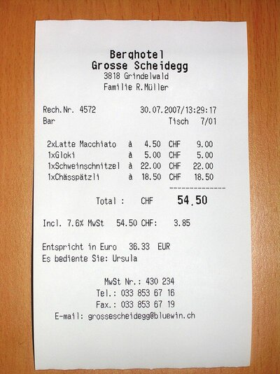
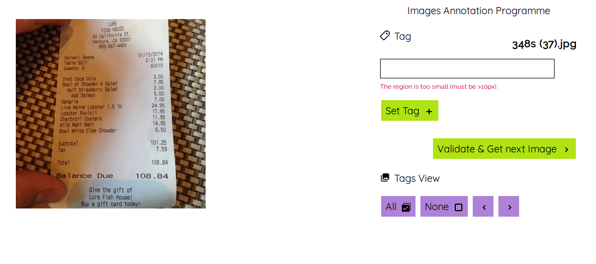

# Receipt OCR

```
Scanned PDFs/Images  ---> Image Preprocessing 
                        ---> Resizing
                        ---> Deskewing
                        ---> Rotation
                        ---> Sharpening 
                        ---> Background noise removal
                        ---> Binarization 
                        ---> Stiching etc.,
                     ---> OCR (Tesseract/DL Models)
                     ---> Doc/Text Classifiers
                        ---> Identifying the receipts etc.,
                     ---> Annotators (Optional)
                     ---> ML/DL Model (Optional)
                     ---> Data Insights 
                        ---> Format templates
                        ---> Regex
                     ---> Text PostProcessing
                        ---> Spell checks
                        ---> Word combiners
```

## Receipt OCR

### Introduction
	In this example, we show solution for extracting information from the given documents.
### Aim
	Given a receipt, the aim is to extract the domain specific fields by using deep-learning techinques.
### Steps


The above diagram depicts the various 
- Dataset
    - We use the dataset present on the [website](http://expressexpense.com/view-receipts.php).
    These are the receipts collected from various sources and are of various types.
    
- Data Preparation
    - Web scrabbing : scrapy 
    - We use the python library called scrapy in order to crawl and download all the images
    - we have around ~2k receipt images.
    
    
- Data Annotation
    - We annotate around 125 images using image annotation [tool](https://github.com/frederictost/images_annotation_programme). 
    - The information we are interested from the receipts are 
        - Merchant - name of the store
        - Receipt number - bill id
        - Date-  receipt issue date
        - Line items and their value - items in cart and their value
        - Total - final total value paid
        - Tax - tax calculated on line items
        - Mode of payment - card/cash
    
    
- Object Detection
    - We leverage the existing pre-trained models for the detecting the above points of interest by using [Tensorflow Object Detection API](https://github.com/tensorflow/models/tree/master/research/object_detection)
- Image Segmentation and Cropping
    - Following folder structure is adopted to output the images by croping the receipt image for predicted co-ordinates and labels
        ```
        image_name_1\
            label_1.jpg
            label_2.jpg
            label_3.jpg
         ...
        ```
- OCR : Tesseract. Converts the cropped images to text

        image_name_1\
            label_1.txt
            label_2.txt
            label_3.txt
        ...  
- Text Postprocessing : Domain specific 

        image_name_1.csv
        ...

### Experiment Goal
- Provide a end-to-end solution for information extraction from images.
- Achieve decent accuracy with very few annotated images. 

## Explorations

**Python Libs:**
- https://pypi.org/project/pytesseract/
- https://gitlab.gnome.org/World/OpenPaperwork/pyocr
- https://github.com/deanmalmgren/textract

**Paper**
- https://hal.archives-ouvertes.fr/hal-01654191/document 
- https://nlp.fi.muni.cz/raslan/2017/paper06-Ha.pdf
- https://arxiv.org/pdf/1708.07403.pdf
- http://cs229.stanford.edu/proj2016/report/LiuWanZhang-UnstructuredDocumentRecognitionOnBusinessInvoice-report.pdf

**Dataset**
- http://www.cs.cmu.edu/~aharley/rvl-cdip/
- https://storage.googleapis.com/openimages/web/index.html
- http://machinelearning.inginf.units.it/data-and-tools/ghega-dataset
- http://expressexpense.com/view-receipts.php

**Git References:**
- [https://github.com/invoice-x/invoice2data](https://github.com/invoice-x/invoice2data)
- [https://github.com/mre/receipt-parser](https://github.com/mre/receipt-parser) Works only for a single format
- [https://github.com/VTurturika/receipt-recognition](https://github.com/VTurturika/receipt-recognition)

**Other**
- https://uu.diva-portal.org/smash/get/diva2:967971/FULLTEXT01.pdf
- https://eng.infoscout.co/receipt_store_detection/
- https://ryubidragonfire.github.io/blogs/2017/06/06/Automating-Receipt-Processing.html
